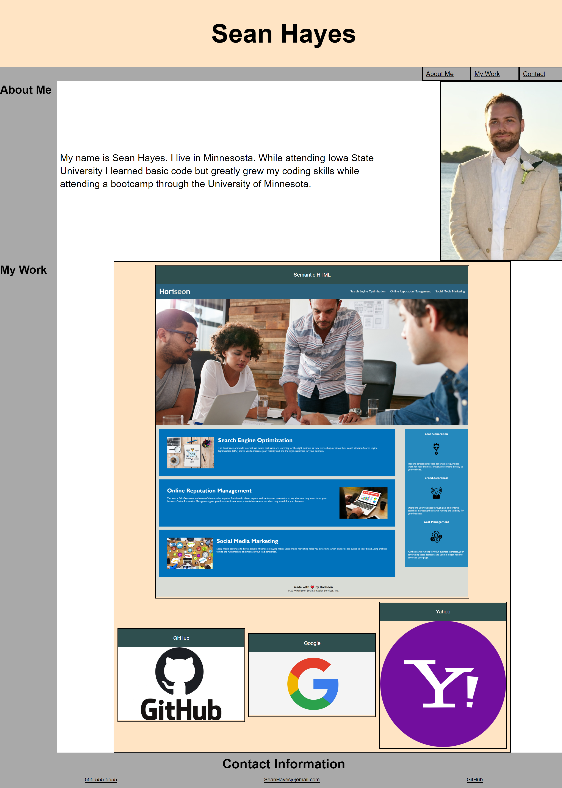

# portfolio

## Descripion

For this project I started from scratch and built it into a portfolio using HTML and CSS code. Things that are included are my name, contact info, and a little bit about me. In addition to that some navigation links have been provided to get around the page. Then finally I added some of my work that has been provided with links to them. This page will adjust to fit most screens.

## technologys

The webpage uses HTML and CSS

## learned

I learned how to format items across a webpage and how to make the webpage display nicely on different resolution devices. 

## Task

GIVEN I need to sample a potential employee's previous work
WHEN I load their portfolio
THEN I am presented with the developer's name, a recent photo or avatar, and links to sections about them, their work, and how to contact them
WHEN I click one of the links in the navigation
THEN the UI scrolls to the corresponding section
WHEN I click on the link to the section about their work
THEN the UI scrolls to a section with titled images of the developer's applications
WHEN I am presented with the developer's first application
THEN that application's image should be larger in size than the others
WHEN I click on the images of the applications
THEN I am taken to that deployed application
WHEN I resize the page or view the site on various screens and devices
THEN I am presented with a responsive layout that adapts to my viewport

## Struggles 

The biggest struggle that I ran into during this project was remembering to position the container box to where I wanted the items to go. Once I got into the habit of that everything went very smoothly. 

## Usage
Use the navagation links in the top right to get around the page. By clicking on the projects a new page will open to it.

## Webpage
https://hayessea000.github.io/portfolio/
